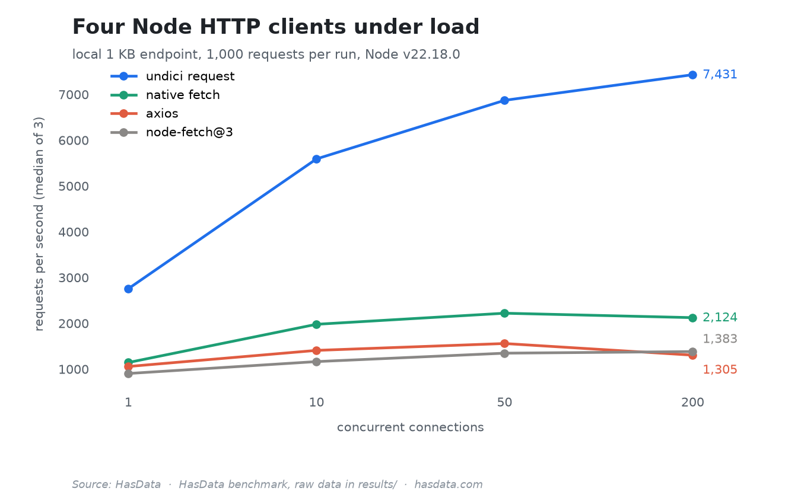

# Node.js HTTP Clients Benchmark


Throughput under load for four Node.js HTTP clients, `fetch`, `axios`, `node-fetch` and `undici.request`, measured against a local server so the network doesn't add noise. The numbers back the benchmark sections of [our Node.js fetch guide](https://hasdata.com/blog/nodejs-fetch-api?utm_source=github&utm_medium=syndication&utm_campaign=nodejs-fetch-api&utm_content=nodejs-fetch-benchmark-readme) and [axios vs fetch](https://hasdata.com/blog/axios-vs-fetch?utm_source=github&utm_medium=syndication&utm_campaign=nodejs-fetch-api&utm_content=nodejs-fetch-benchmark-readme).

## Table of Contents

- [Results](#results)
- [What Is Measured](#what-is-measured)
- [Running It](#running-it)
- [Disclaimer](#disclaimer)
- [More Resources](#more-resources)

## Results

Raw numbers per client and concurrency level are in `results/throughput_results.json`, taken on Node v22.18.0 under Windows 11 Pro, an AMD Ryzen 3 5300U with 6 GB of RAM, 1,000 requests per run, medians of 3 runs. The spread at the two ends:

| Client | 1 connection | 200 connections | Peak RSS at 200 |
|---|---:|---:|---:|
| `undici.request` | 2,756 req/s | 7,431 req/s | 92 MB |
| native `fetch` | 1,144 req/s | 2,124 req/s | 157 MB |
| `node-fetch@3` | 904 req/s | 1,383 req/s | 158 MB |
| `axios` | 1,057 req/s | 1,305 req/s | 141 MB |

The curves make the gap easier to see than the two columns:



`undici.request` runs roughly 3.5x faster than native `fetch` at 200 connections while using the least memory. The full file carries all four concurrency levels with min and max per run.

## What Is Measured

A local HTTP server returns a 1 KB HTML body. Each client sends 1,000 requests through a worker pool at concurrency 1, 10, 50 and 200, one client per process. Each run records wall time, requests per second, failures, and peak RSS of the process. Three runs per level, the JSON keeps median, min and max.

## Running It

No configuration, the server is inside the script.

```bash
npm install
node throughput.mjs
```

The run writes `results/throughput_results.json` next to the script and takes a few minutes, most of it at the low-concurrency levels.

## Disclaimer

The benchmark talks only to its own local server. The article links above show how the same clients behave against real sites, where jurisdiction and terms decide what is appropriate. [Is Web Scraping Legal?](https://hasdata.com/blog/is-web-scraping-legal?utm_source=github&utm_medium=syndication&utm_campaign=nodejs-fetch-api&utm_content=nodejs-fetch-benchmark-readme) covers how we think about that question.

## More Resources

- [Node.js Fetch API](https://hasdata.com/blog/nodejs-fetch-api?utm_source=github&utm_medium=syndication&utm_campaign=nodejs-fetch-api&utm_content=nodejs-fetch-benchmark-readme), proxies, timeouts and retries around these clients
- [Axios vs Fetch](https://hasdata.com/blog/axios-vs-fetch?utm_source=github&utm_medium=syndication&utm_campaign=nodejs-fetch-api&utm_content=nodejs-fetch-benchmark-readme), the head-to-head these numbers feed
